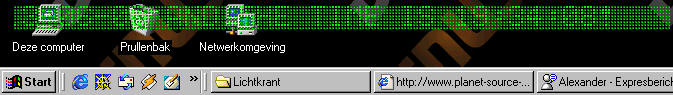



## Marquee

### Description

'This code shows how to make a transparent marquee with time & date functions

'First submission from me
 
### More Info
 
'the parameter (from the commandline) is the text to be displayed in the marquee

'note that this program uses Chris Yates' autoshape form.

'sometimes the program gets sticky if you click the rightmousebutton

             |
---                |---
**Submitted On**   |2000-06-13 19:20:02
**By**             |[xTinus](https://github.com/Planet-Source-Code/PSCIndex/blob/master/ByAuthor/xtinus.md)
**Level**          |Advanced
**User Rating**    |4.6 (23 globes from 5 users)
**Compatibility**  |VB 5\.0, VB 6\.0
**Category**       |[Miscellaneous](https://github.com/Planet-Source-Code/PSCIndex/blob/master/ByCategory/miscellaneous__1-1.md)
**World**          |[Visual Basic](https://github.com/Planet-Source-Code/PSCIndex/blob/master/ByWorld/visual-basic.md)
**Archive File**   |[CODE\_UPLOAD67466132000\.zip](https://github.com/Planet-Source-Code/xtinus-marquee__1-8898/archive/master.zip)

